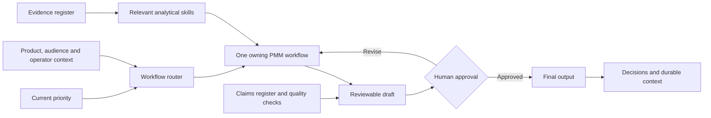

# AI-Native Product Marketing Workspace

> A portable operating system for turning product, market and customer evidence into clearer product marketing decisions.

**Built for:** Cursor · Claude Code · Codex  
**Designed around:** PMM strategy · commercial analysis · evidence governance · human approval

## Why this exists

Most AI use at work begins and ends with individual prompts. This workspace takes a different approach: it gives an AI assistant a durable operating model, clear decision boundaries, reusable analytical methods and a governed knowledge base.

The objective is not to automate product marketing judgment. It is to make good judgment more repeatable, traceable and easier to scale.

## What this demonstrates

- **Product marketing judgment:** work begins with the audience and decision, not the requested format.
- **Commercial analysis:** dedicated methods cover segment opportunity, revenue whitespace, cross-sell/up-sell and win/loss.
- **AI operating-system design:** rules, context, workflows, skills, templates and quality controls have distinct roles.
- **Evidence discipline:** sources and external claims have separate registers, owners, limitations and review dates.
- **Adoption thinking:** the system is designed to be understandable and usable by colleagues, not only its creator.
- **Tool portability:** one source of operating instructions works across Cursor, Claude Code and Codex.

## Proven through use

An earlier private product-marketing version of this operating model was used for approximately five months and adopted by four colleagues. When enterprise tooling changed, I migrated the workspace from Cursor to Claude Code rather than losing the operating knowledge embedded in it. This public version rebuilds the concept cleanly and adds Codex support.

The value was not a single prompt. It was the ability to structure work once, improve it through use and carry it between AI tools.

## The MECE operating model

### Five workflows own the outcome

| Stage | Primary decision | Owned deliverable |
|---|---|---|
| **Discover** | Where is the evidence-backed opportunity? | Opportunity brief |
| **Define** | Who will we prioritise, what will we stand for and why should they believe us? | PMM strategy brief |
| **Activate** | How will we take the strategy to market and equip each channel? | Market activation plan |
| **Grow** | How will we improve adoption, retention or expansion? | Customer growth plan |
| **Learn** | What happened, why, and what should change next? | Performance and learning review |

### Eight skills own the analytical method

| Unit of analysis | Skill |
|---|---|
| Source or observation | Evidence synthesis |
| Market, segment or use case | Segment opportunity analysis |
| Competitor or alternative | Competitive analysis |
| Offer, package or price point | Pricing and packaging analysis |
| Aggregate product × segment cell | Revenue whitespace analysis |
| Account × product | Cross-sell/up-sell analysis |
| Commercial opportunity | Win/loss analysis |
| Initiative × cohort × time | Performance measurement |

The rule is simple: choose **one workflow** based on the decision, then add only the skills required to support it. A deck, memo or battlecard is a format, not a workflow.

## How the system works



Read the [architecture guide](docs/architecture.md) for the design logic and boundaries.

## Start in five minutes

1. Complete `context/product.md`, `context/audiences.md` and `context/current-priorities.md`.
2. Add your working preferences to `context/operator-profile.md`.
3. Open the folder in Cursor, Claude Code or Codex.
4. Start with:

   > Read `WORKSPACE.md` and `START-HERE.md`. Summarise what you understand, identify important gaps and help me with my highest-priority task.

5. Save reviewed deliverables under `outputs/`.

Unknown fields should remain blank. The system is explicitly instructed not to invent evidence to complete a template.

## Two-minute tour

If you are reviewing the repository, start here:

1. [`WORKSPACE.md`](WORKSPACE.md) — the shared operating instructions.
2. [`workflows/README.md`](workflows/README.md) — how PMM outcomes are routed.
3. [`skills/README.md`](skills/README.md) — the analytical boundaries.
4. [`context/evidence-register.md`](context/evidence-register.md) and [`context/claims-and-proof.md`](context/claims-and-proof.md) — evidence governance.
5. [`docs/origin-and-evolution.md`](docs/origin-and-evolution.md) — how the system developed through real use and migration.

## Repository structure

```text
product-marketing-workspace/
├── WORKSPACE.md             Shared operating instructions
├── START-HERE.md            Five-minute setup
├── AGENTS.md                Codex entry point
├── CLAUDE.md                Claude Code entry point
├── .cursor/rules/           Cursor entry point
├── context/                 Durable knowledge, evidence and decisions
├── workflows/               Five end-to-end PMM outcomes
├── skills/                  Eight specialist analytical methods
├── templates/               Reusable PMM deliverable structures
├── prompts/                 Copy-ready starting prompts
├── quality/                 Review and workspace health checks
├── docs/                    Architecture and provenance
└── outputs/                 Human-reviewed deliverables
```

## Design principles

1. **Decisions before deliverables.** Clarify what should change before choosing a format.
2. **Evidence before claims.** A useful finding does not automatically become an approved marketing claim.
3. **One owner per concern.** Workflows own outcomes; skills own analytical methods; context files own durable knowledge.
4. **Human approval remains explicit.** Every output is a draft until reviewed.
5. **Portability over platform lock-in.** The operating model belongs to the user, not the AI tool.
6. **Confidentiality by design.** The public workspace contains structure, not employer or customer material.

## Origin and provenance

The original inspiration was an internal Cursor learning workspace created by a senior leader. I did not create that original system. I recognised the value of its file-based rules, memory and reusable capabilities; templatized the pattern; adapted it to product marketing; supported adoption by four colleagues; and later migrated the working system when the enterprise tool changed.

This repository is an independent, clean reconstruction. It contains no original private scripts, employer information, customer data or confidential examples. See [`docs/origin-and-evolution.md`](docs/origin-and-evolution.md) for the full account.

## Safety and distribution

- Do not place credentials, personal data or restricted material in the workspace.
- Keep real working copies private unless their contents are approved for publication.
- Review claims, outputs and generated analysis before external use.
- Run `quality/workspace-health-check.md` before sharing a populated copy.

## Status

Version 1.0 is a focused, documentation-first workspace. It intentionally avoids manufactured case studies and unnecessary automation. Future changes should be driven by real PMM use.
