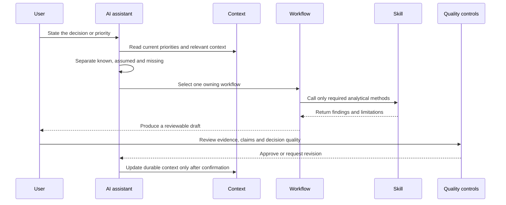

# Architecture

## Design objective

The workspace separates six concerns that are often mixed together in AI-assisted work:

| Layer | Owns | Does not own |
|---|---|---|
| Platform entry point | Telling Cursor, Claude Code or Codex where the shared instructions live | PMM logic |
| Operating instructions | Behaviour, session protocol, confidentiality and quality standards | Task-specific analysis |
| Context | Durable, reviewed knowledge and decisions | Temporary drafts |
| Workflows | One end-to-end PMM decision and its deliverable | Specialist analytical methods |
| Skills | One reusable analytical method and its findings | The final business deliverable |
| Quality controls | Evidence, claim and approval checks | Creating evidence that does not exist |

## Runtime flow

## Why workflows and skills are separate

A workflow answers: **What decision and deliverable are we producing?**

A skill answers: **What specialist method should we use to analyse part of that decision?**

For example, a customer-growth workflow may call revenue-whitespace analysis at the aggregate product-and-segment level, followed by cross-sell/up-sell analysis at the account-and-product level. The analyses are distinct, while the customer-growth plan remains the single owned deliverable.

## MECE boundary

The five workflows are mutually exclusive by primary decision and collectively cover the intended PMM lifecycle: discover, define, activate, grow and learn.

The eight analytical skills are mutually exclusive by primary unit of analysis. When several skills are used, each must operate on a genuinely different unit. This prevents the same question from being answered twice under different labels.

## Memory model

The workspace does not depend on conversational memory. Durable knowledge lives in files with different owners:

- product and audience facts;
- approved messaging;
- competitors and alternatives;
- source provenance;
- claims and approval status;
- current priorities;
- confirmed decisions;
- brief session continuity;
- automation opportunities.

This makes the system inspectable, portable and recoverable when the AI tool changes.

## Control model

Three safeguards apply throughout:

1. Material findings should trace to a source in the evidence register.
2. External claims require a separate approval status and review date.
3. Outputs remain drafts until a human approves them.

The result is an AI-enabled workspace, not an autonomous publishing system.
